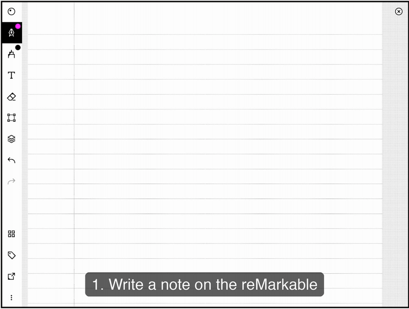

# Tagged Sync for reMarkable

> **Disclaimer:** Tagged Sync for reMarkable is an unofficial, community-built plugin. It is not
> affiliated with, endorsed by, or supported by reMarkable AS. "reMarkable" is a trademark of
> reMarkable AS, used only to describe compatibility.

Sync tagged reMarkable notebooks into Obsidian as searchable Markdown notes, routed to folders
by tag.

Tag a notebook or a single page on your reMarkable tablet (e.g. `sync`), and this plugin pulls
it from the reMarkable cloud, renders the handwriting to a PDF, transcribes it to searchable
text, and writes a Markdown note into the vault folder mapped to that tag — with the render
embedded as an attachment and the transcript underneath it.

This is a **desktop-only**, **one-way** (reMarkable → Obsidian) sync. It never writes back to
your reMarkable.


## How it works

1. Tag a notebook or page on your reMarkable — e.g. `sync`.
2. The note syncs to the reMarkable cloud as usual.
3. In Obsidian, map that tag to a vault folder in the plugin settings.
4. Run **Sync now** (or let automatic sync do it).
5. You get a Markdown note with the handwriting render embedded and a searchable transcript below.



## Before you install

Two limits, so you know them up front:

- **This free version syncs one tag.** You map one reMarkable tag to one vault folder. You can
  change or remove that mapping at any time. The one-tag limit is a limit of the free version: a
  paid version that lifts it is planned but not yet available. Everything described in this
  README works without payment.
- **Text transcription needs macOS 13 or later.** On Windows and Linux your notes still sync,
  with the full handwriting render embedded — but there is no transcript.

## Handwriting transcription

Transcription runs locally on **macOS 13 or later** using Apple's Vision framework — no account,
no API key, no network. On **Windows and Linux** there is no transcription: notes sync with the
handwriting render embedded, and no `## Transcript` text.

You can also set the backend to **Off** if you only want the render. That is the default where
Apple Vision cannot run.

How the local backend works, for transparency:

- Each page is rendered to a temporary PNG under your OS temp directory (`os.tmpdir()`), never
  under Documents/Desktop/Downloads/iCloud. The plugin deletes these images as soon as
  transcription finishes.
- The PNGs are transcribed by invoking the built-in `/usr/bin/osascript` binary, which drives
  Apple's Vision framework. This runs entirely on your machine with **no network egress** — no
  page image or text ever leaves the device.

Apple Vision auto-detects language and reads cursive well, but produces **flat text** — no
headings, lists, task lists, or tables. Its structured API is macOS Swift-only and unavailable
here. It can also misread; see [Correcting a transcript](#correcting-a-transcript).

## Network use

This plugin makes network requests to exactly one place:

- **reMarkable cloud** (required) — the plugin authenticates to `my.remarkable.com` via a
  one-time device code, then reads your notebook/page list, tags, and content over the
  reMarkable cloud API to sync it into your vault. This is read-only; nothing is written back to
  your reMarkable account.

Transcription is local. Nothing else is contacted.

No telemetry or analytics of any kind are collected or sent by this plugin.

## Other permissions this plugin uses

Two behaviours show up in Obsidian's automated plugin review, so they are spelled out here:

- **Clipboard — write only.** The *Copy diagnostics* button in settings writes your plugin
  version, Obsidian version, platform, selected OCR backend, number of mapped tags, and last sync
  time to the clipboard, so you can paste them into a bug report. The plugin **never reads** your
  clipboard, and nothing is sent anywhere — you choose where to paste it.
- **Vault folder list.** The tag-routing settings read the list of folders in your vault to fill
  the "map this tag to a folder" dropdown. Only folder *paths* are read; note contents are never
  scanned for this, and the list never leaves your machine.

## Setup

1. Install and enable the plugin.
2. Open **Settings → Tagged Sync for reMarkable**, and follow the "Connect" link to
   `my.remarkable.com/device/browser/connect` to get a one-time code. Enter it and click
   **Connect**. Codes expire after a few minutes, so get a fresh one if it is refused.
3. Click **Discover tags** to scan your reMarkable notebooks and pages for tags, then map the
   tag you want to sync to a vault folder. Only a mapped tag is synced — an unmapped tag is
   simply not selected, not lost.
4. Click **Sync now**.

Sync is also available from the command palette as **Tagged Sync for reMarkable: Sync now**.


### Automatic sync

Off by default. Under **Automatic sync** you can turn on a sync when Obsidian launches, plus an
interval backstop while it stays open. A manual sync pushes the next automatic one out rather
than triggering a redundant run.

### Re-transcribing

To refresh transcripts on notes you already synced, run **Tagged Sync for reMarkable: Re-transcribe
all synced notes**. It re-fetches each notebook and rewrites only the transcript region, leaving
your own notes and the embedded render untouched. It asks for confirmation first.

## What gets synced

- A notebook tagged with a mapped tag syncs as one note for the whole notebook.
- An individual page tagged with a mapped tag syncs as its own note, independent of any
  notebook-level tag.
- Each note has the rendered PDF embedded, then a `## Highlights` section (one quote callout per
  page, if you highlighted anything on the tablet), then the `## Transcript`. If transcription
  is off, fails, or finds nothing, the note is still created with the render and no `## Transcript`
  section — the render is never lost.
- A synced note carries **no frontmatter**. Everything the sync needs to track lives in the
  plugin's own `data.json`, not in your notes.
- Removed or untagged units are **never deleted**. The plugin stops updating them and leaves the
  note exactly where it is, so nothing you already have can disappear.

### Correcting a transcript

Everything between the `tagged-sync:begin` and `tagged-sync:end` markers is rewritten on every
sync. Your own writing belongs **below** that block, where it is preserved.

If you do edit inside the block — for example to fix a misread word — the plugin notices and
**refuses to overwrite that note**, telling you which notes it skipped. Your edit is never
silently erased. Move it below the block to let syncing resume.

## Limitations

- Desktop only. Obsidian on mobile is unsupported.
- One-way sync: reMarkable → Obsidian only. Nothing is ever written back to your tablet.
- One tag → folder mapping.
- Transcription requires **macOS 13 or later**. Windows and Linux get the render and no text.
- Transcripts are flat text — no headings, lists, task lists, or tables.
- The reMarkable cloud API used here (via `rmapi-js`) is reverse-engineered and unversioned;
  firmware changes on reMarkable's side can break sync. See below.

> **What I do not control**
>
> This plugin talks to the reMarkable cloud. I do not work for reMarkable. I have no contract with
> them and no advance warning of their plans. They can change or switch off their cloud at any
> time. This already happened: in April 2026 a format change broke every tool in this space.
>
> If it happens again:
>
> - I will work on a fix as fast as I can. **I cannot promise a date.**
> - **Your notes are safe.** Everything already synced is plain Markdown and PDF in your own
>   vault. It stays there. Nothing is deleted.

## Reporting a problem

Open an issue at
[github.com/thomas-hochbichler/obsidian-remarkable-tagged-sync/issues](https://github.com/thomas-hochbichler/obsidian-remarkable-tagged-sync/issues).

Before you write it, press **Copy diagnostics** in the plugin settings and paste the result into
the issue. It contains your plugin and Obsidian versions, your OS, whether Apple Vision is
available, and the last error — nothing is sent anywhere by pressing it.

## Development

```bash
npm install
npm run dev      # watch build
npm run build    # typecheck + production build
npm test         # vitest
```

## License

Apache-2.0 — see [LICENSE](./LICENSE). Third-party notices are in [NOTICE](./NOTICE).
