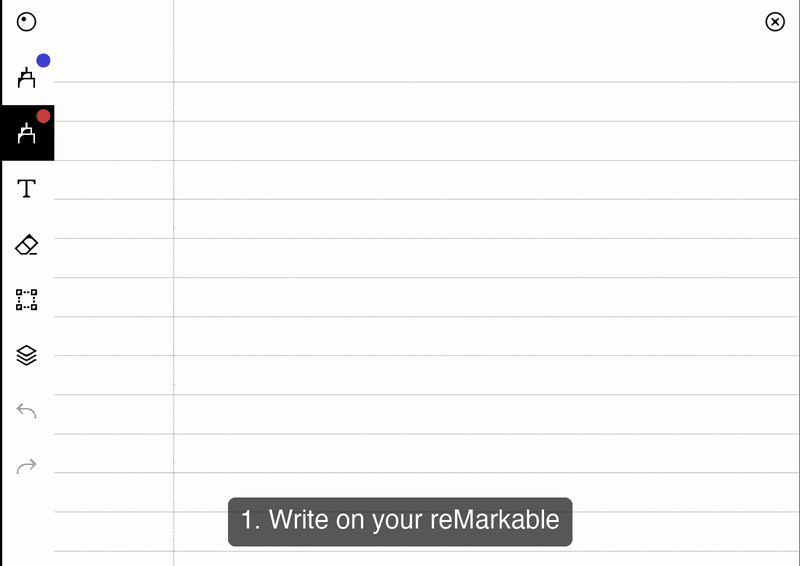
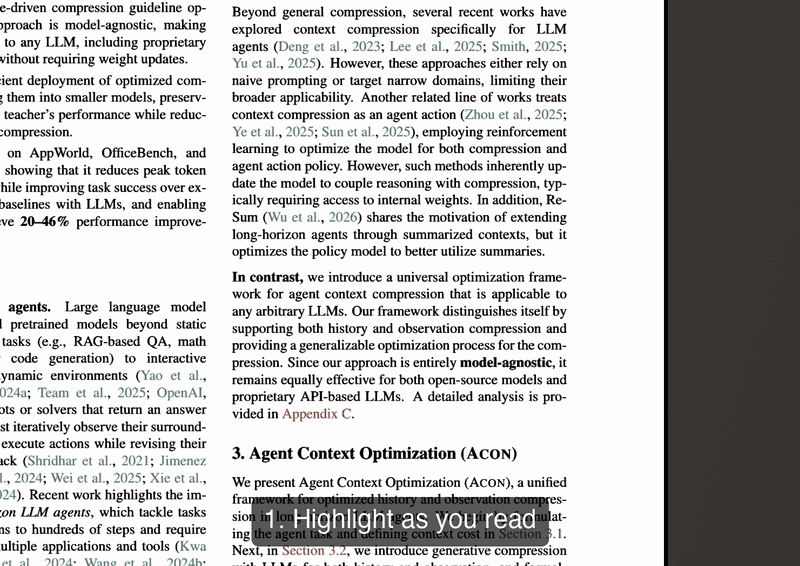
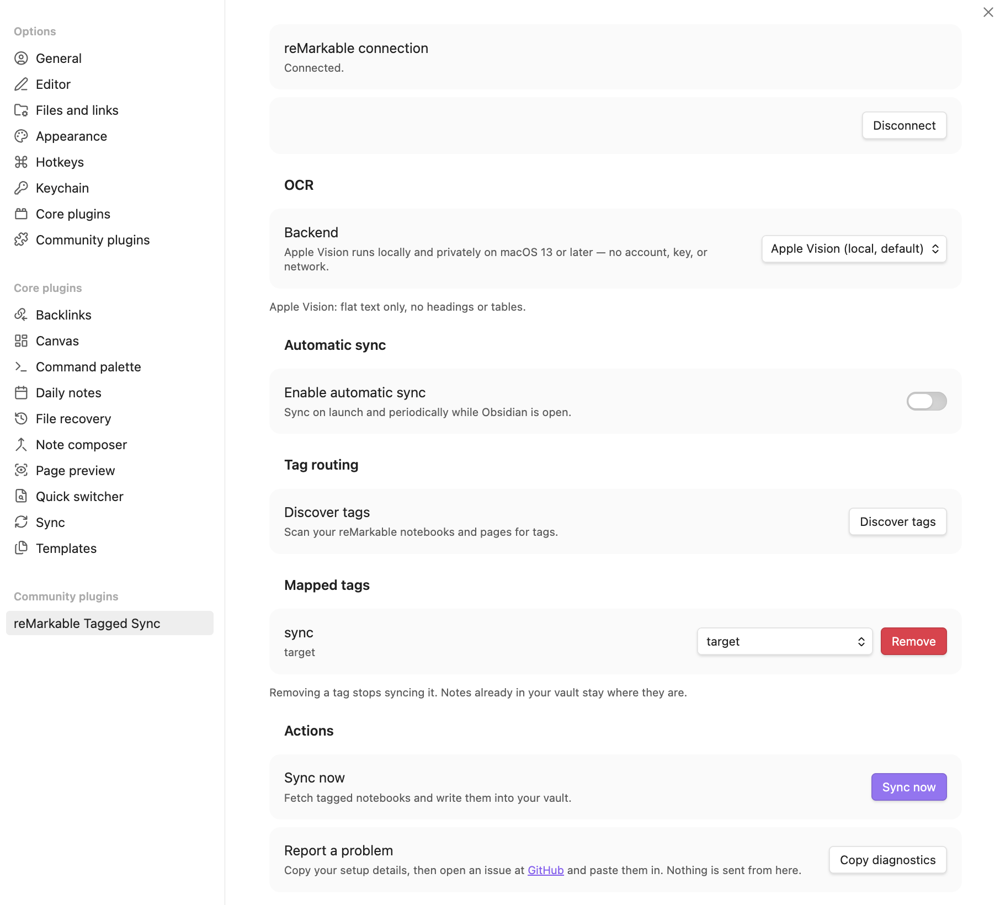
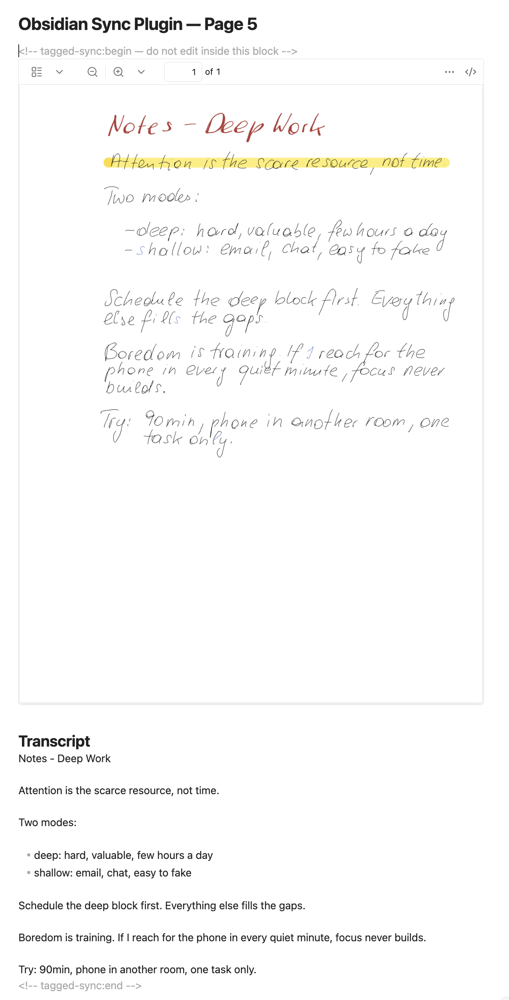
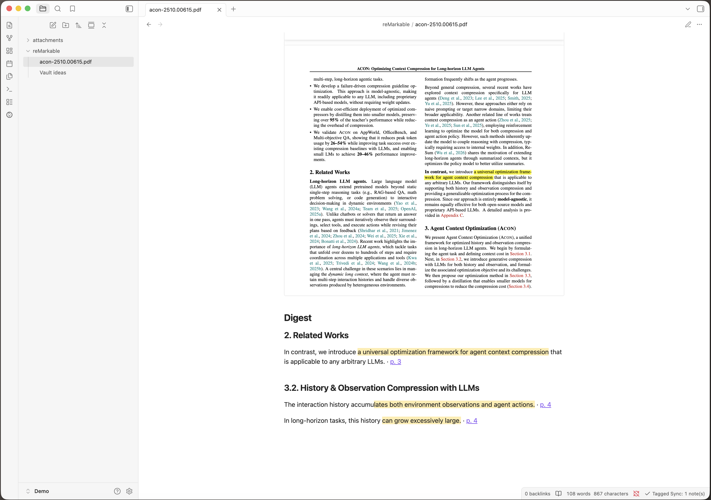
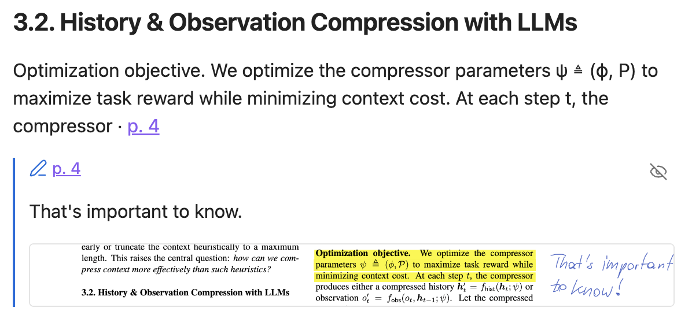

# Tagged Sync for reMarkable

**[taggedsync.com](https://taggedsync.com)** — the short version, in pictures.

[](https://github.com/thomas-hochbichler/obsidian-remarkable-tagged-sync/blob/main/.coverage-baseline.json)
[](https://github.com/thomas-hochbichler/obsidian-remarkable-tagged-sync/blob/main/.coverage-baseline.json)

> **Disclaimer:** Tagged Sync for reMarkable is an unofficial, community-built plugin. It is not
> affiliated with, endorsed by, or supported by reMarkable AS. "reMarkable" is a trademark of
> reMarkable AS, used only to describe compatibility.

Tag a notebook or a PDF on your reMarkable, and it lands in the vault folder you mapped — your
handwriting transcribed, your highlights quoted.

**Your handwriting never leaves your machine.** Rendering and transcription run on your own
computer — no upload, no account with us. The plugin is free; Pro is an optional add-on for
€24 once, no subscription.

## A notebook you wrote in

The pages as you drew them, embedded in the note, plus a searchable transcript underneath — split
by page, so a long notebook stays navigable.



## A PDF you marked up

Every passage you highlighted or underlined, quoted with the sentence around it and filed under the
section it came from. Each quote carries a block ID, so you can link a single passage from anywhere
in your vault. None of it goes through transcription, so this works the same on Windows and Linux as
it does on a Mac.



<sub>PDF shown: Kang et al., <a href="https://arxiv.org/abs/2510.00615">ACON: Optimizing Context
Compression for Long-horizon LLM Agents</a>, CC BY 4.0.</sub>

**Desktop only** · **one-way** (reMarkable → Obsidian) · never writes back to your tablet.

## What makes it different

Every feature at a glance, Free against Pro. Most rows link to the section that explains them.

| Feature | Free | Pro |
|---|:---:|:---:|
| **Direction & safety** | | |
| [reMarkable → Obsidian sync](#how-it-works) | ✓ | ✓ |
| [One-way by design — never writes to your tablet](#what-gets-synced) | ✓ | ✓ |
| [No reMarkable Connect subscription needed](#install-and-set-up) | ✓ | ✓ |
| [Sync straight from the tablet, without the reMarkable cloud](#syncing-without-the-cloud) | — | ✓ |
| [Your edits are never silently overwritten](#writing-your-own-notes) | ✓ | ✓ |
| [Never deletes a synced note](#what-gets-synced) | ✓ | ✓ |
| [Stop a running sync](#stopping-a-sync) | ✓ | ✓ |
| **What arrives in your vault** | | |
| [Handwritten notebooks, page render embedded](#what-gets-synced) | ✓ | ✓ |
| [Handwriting → searchable text](#handwriting-transcription) | ✓ | ✓ |
| [PDF highlights extracted as quotes, with the sentence around them](#annotated-pdfs) | ✓ | ✓ |
| [Pen marks — underline, circle — count as annotations](#annotated-pdfs) | ✓ | ✓ |
| [Margin notes transcribed and placed at the passage they point at](#the-notes-you-write-in-the-margin) | ✓ | ✓ |
| [Block IDs — every quote linkable on its own](#annotated-pdfs) | ✓ | ✓ |
| [Typed text (Type Folio) kept exact, never transcribed](#typed-text-and-the-type-folio) | ✓ | ✓ |
| [Notebook highlights from the tablet](#what-gets-synced) | ✓ | ✓ |
| [EPUB books, with their own chapter names](#books-you-read-as-epub) | ✓ | ✓ |
| **Transcription backends** | | |
| [Apple Vision — zero set-up on macOS](#apple-vision-macos) | ✓ | ✓ |
| [A local server you run yourself (Ollama, LM Studio)](#a-local-server-you-run-yourself) | ✓ | ✓ |
| [Managed local model — one click, checked hashes](#local-model-optional-opt-in) | ✓ | ✓ |
| [Cloud transcription with your own API key](#tagged-sync-pro) | — | ✓ |
| [Re-transcribe notes you already synced](#re-transcribing) | ✓ | ✓ |
| **Organization** | | |
| [Tag → folder routing](#how-it-works) | 1 tag | unlimited |
| [Selective sync — only what you tag](#how-it-works) | ✓ | ✓ |
| [A tagged folder hands its tag to everything inside](#what-gets-synced) | ✓ | ✓ |
| **Sync behaviour** | | |
| [Automatic sync — on launch, plus an interval](#automatic-sync) | ✓ | ✓ |
| Incremental sync | ✓ | ✓ |
| **Platforms** | | |
| [Windows, macOS, Linux](#install-and-set-up) | ✓ | ✓ |
| [reMarkable 1, 2, Paper Pro, Paper Pure](#works-with) | ✓ | ✓ |

Pro is **€24, once** — no subscription. See [Tagged Sync Pro](#tagged-sync-pro).

## Works with

| Device / accessory | Status |
|---|---|
| reMarkable 2 | ✓ |
| reMarkable 1 | ✓ |
| reMarkable Paper Pro | ✓ — its larger canvas, its colour palette, and the shader highlighter are all handled; the fixes came from Paper Pro users' own files |
| reMarkable Paper Pure | ✓ |
| **Type Folio** (typed text) | ✓ — taken from the file exactly as you typed it, [never transcribed](#typed-text-and-the-type-folio) |
| "Read on reMarkable" browser extension | ✓ — a sent article counts as [a document to mark up](#typed-text-and-the-type-folio) |
| **EPUB books** | ✓ — read as [the book the device made of them](#books-you-read-as-epub), not as ink on blank pages |

Obsidian itself must be the **desktop** app — see [Limitations](#limitations).

## Contents

- [Before you install](#before-you-install)
- [How it works](#how-it-works)
- [Install and set up](#install-and-set-up)
- [Handwriting transcription](#handwriting-transcription)
- [Typed text and the Type Folio](#typed-text-and-the-type-folio)
- [Tagged Sync Pro](#tagged-sync-pro)
- [Syncing without the cloud](#syncing-without-the-cloud)
- [Annotated PDFs](#annotated-pdfs)
- [What gets synced](#what-gets-synced)
- [Limitations](#limitations)
- [Privacy and permissions](#privacy-and-permissions)
- [Support](#support)
- [Reporting a problem](#reporting-a-problem)
- [Requesting a feature](#requesting-a-feature)

## Before you install

Two limits, so you know them up front:

- **The free version syncs one tag.** You map one reMarkable tag to one vault folder. You can
  change or remove that mapping at any time. Syncing more than one tag is what
  [Tagged Sync Pro](#tagged-sync-pro) is for — €24 once, with a 14-day trial. Everything else in
  this README works without payment, [cloud transcription](#tagged-sync-pro) aside.
- **Text transcription is built in on macOS 13 or later.** Everywhere else — Windows, Linux, older
  Macs — you can transcribe by pointing the plugin at a local AI server you run yourself
  ([Ollama, LM Studio, or any OpenAI-compatible server](#a-local-server-you-run-yourself)), or by
  using the optional [managed local model](#local-model-optional-opt-in) where your machine
  qualifies. With none of those set up, your notes still sync with the full handwriting render
  embedded — but there is no transcript. **Marked-up PDFs and [typed
  documents](#typed-text-and-the-type-folio) are unaffected:** both are read from the file itself
  and need no transcription at all, so they work everywhere.

## How it works

1. Tag a notebook, a PDF, a single page, or a whole folder on your reMarkable — e.g. `sync`.
2. It syncs to the reMarkable cloud as usual — or, with Pro, the plugin reads it
   [straight off the tablet](#syncing-without-the-cloud) and the cloud never comes into it.
3. In Obsidian, map that tag to a vault folder in the plugin settings.
4. Run **Sync now** (or let automatic sync do it).
5. You get a Markdown note with the render embedded, and either a searchable transcript or a digest
   of your marks below it.

## Install and set up

You need Obsidian **1.5.7 or later** on **desktop** (Windows, macOS, or Linux — Obsidian on mobile
is unsupported), and a reMarkable account with cloud sync switched on — unless you sync
[straight from the tablet](#syncing-without-the-cloud), which needs no account at all.

1. In Obsidian, open **Settings → Community plugins → Browse**, search for **Tagged Sync for
   reMarkable**, and click **Install**, then **Enable**.
2. Open **Settings → Tagged Sync for reMarkable**, and follow the "Connect" link to
   `my.remarkable.com/device/browser/connect` to get a one-time code. Enter it and click
   **Connect**. Codes expire after a few minutes, so get a fresh one if it is refused.
3. Click **Discover tags** to scan your reMarkable notebooks, pages and folders for tags, then map
   the tag you want to sync to a vault folder. Only a mapped tag is synced — an unmapped tag is
   simply not selected, not lost.
4. Click **Sync now**.

Sync is also available from Obsidian's command palette (`Ctrl`/`Cmd` + `P`) as **Tagged Sync for
reMarkable: Sync now**.



### Stopping a sync

While a sync is running, the status bar shows a turning icon. Click it and confirm, or run **Tagged
Sync for reMarkable: Stop sync** from the command palette. This works for an automatic sync and for
re-transcribing too.

Stopping is safe rather than instant: the note being transcribed right now is finished first, so it
can take a moment — the status bar says `stopping…` meanwhile. Everything already written is kept,
and the next sync carries on from where it left off.

### Automatic sync

Off by default. Under **Automatic sync** you can turn on a sync when Obsidian launches, plus an
interval backstop while it stays open. A manual sync pushes the next automatic one out rather
than triggering a redundant run.

### Re-transcribing

To refresh transcripts on notes you already synced, run **Tagged Sync for reMarkable: Re-transcribe
all synced notes**. It re-fetches each notebook and rewrites only the transcript region, leaving
your own notes and the embedded render untouched. It asks for confirmation first.

This is also the way to fill in a transcript that never arrived — a note synced while the local
model was still downloading, or while its engine was missing, keeps its render and no text, and
nothing refills it on its own. Re-transcribing does. With the local model selected the
confirmation tells you how long it will take on your machine, measured from your own pages.

## Handwriting transcription



Three backends can read your handwriting **entirely on your own machine** — no account, no API key,
no page image or text ever leaving the device. They are free, and they are the default. Whichever
you pick, each page is rendered to a temporary PNG under your OS temp directory (`os.tmpdir()`) and
deleted as soon as it has been read.

| Backend | Where it runs | Set-up |
|---|---|---|
| [Apple Vision](#apple-vision-macos) | macOS 13 or later | none, it is the default there |
| [A local server you run yourself](#a-local-server-you-run-yourself) | everywhere | install Ollama or LM Studio |
| [Managed local model](#local-model-optional-opt-in) | Apple Silicon, Windows on ARM | one opt-in click, 5.5 GB download |

Four **cloud** backends are also available, with [Tagged Sync Pro](#tagged-sync-pro). Those are the
one case where a page image leaves your device: you choose them, they use your own API key, and they
are off unless you turn them on.

**Apple Vision aside, you name the model yourself.** The Model field starts empty on every backend,
local and cloud alike, and the plugin suggests nothing: a model id shipped inside a plugin goes stale
the day its provider retires it, and the error you then get reads like a problem with your API key
rather than what it is. Take a current name from your provider's own list. Until you do, settings
says so, and a sync reports *"No model is set for this OCR backend"* rather than quietly producing
no transcript.

On **Windows and Linux** nothing transcribes by default: notes sync with the handwriting render
embedded and no `## Transcript` text, until you set up one of the other two local backends. You can
also set the backend to **Off** on purpose if you only want the render.

### Apple Vision (macOS)

The default on **macOS 13 or later**, and nothing to configure. It auto-detects language and reads
cursive well, but produces **flat text** — no headings, lists, task lists, or tables. Its structured
API is macOS Swift-only and unavailable here. It can also misread; see
[Writing your own notes](#writing-your-own-notes).

For transparency: the page PNGs are transcribed by invoking the built-in `/usr/bin/osascript`
binary, which drives Apple's Vision framework. This runs on your machine with **no network
egress**.

### A local server you run yourself

If you already run — or are willing to install — a local AI server, the plugin can send each page
to it and get the text back. Nothing leaves your machine, and there is no account or key. **This is
the one route that works everywhere**, including Windows on x64 and Linux.

1. Install and start **Ollama**, **LM Studio**, or any other server that speaks the OpenAI
   `/chat/completions` API, and load a **vision** model into it.
2. In the plugin settings, set **Backend** to that server and enter the model's name. The address
   is pre-filled for Ollama and LM Studio; change it only if yours runs elsewhere.

Which model you use is your choice. For what it is worth: **I measured Qwen2.5-VL-7B at 7.6 %
character error** — about three times more accurate than Apple Vision on the same pages — but I
measured it running the model directly, not through one of these servers, so treat it as a starting
point rather than a promise. A text-only model cannot read a page image at all; settings checks the
model you name and says so when it can.

If the server is not running, settings says so, and a sync that hits it leaves the notes with their
render and reports it at the end rather than failing quietly.

### Local model (optional, opt-in)

On some machines you can switch the backend to a **local AI model** instead. It reads handwriting
about three times more accurately than Apple Vision and keeps headings and lists, and like Vision
it runs entirely on your machine. It is **never a default**: a fresh install downloads nothing,
and Apple Vision stays the default on macOS.

Choosing it downloads **5.5 GB of model files plus a 12 MB program**, after an explicit opt-in in
settings. Both are checked against a SHA-256 published in the plugin before anything runs. It is
slow compared with Vision — roughly 15 seconds a page on a fast Mac against Vision's 0.4 — and it
holds about 14 GB of memory while it runs.

**Offered only on:**

| | Requirement |
|---|---|
| macOS | Apple Silicon, 18 GB of memory or more (32 GB recommended) |
| Windows | ARM (Snapdragon X and similar), 24 GB of memory or more |

Intel Macs, Windows on x64 and Linux do not get the option, and settings says why on the machine
itself. **Windows x64 is excluded because Windows Defender quarantines the engine** — the
`llama.cpp` builds for x64 have been flagged as `Trojan:Win32/Wacatac.B!ml` for years, the builds
are unsigned, and nothing this plugin does to its own download changes what a malware scanner
decides about someone else's binary. Windows on ARM uses a different build, which is not flagged.

Like any transcription it misreads sometimes, and it misreads *differently*: Vision's mistakes
usually look broken on the page, while this model writes its mistakes as fluent text. Check
anything that matters against the handwriting.

## Typed text and the Type Folio

Not everything on a reMarkable is ink. Text you type with the **Type Folio** — or send over with
the **"Read on reMarkable"** browser extension — is stored inside the notebook as text, not as
strokes. The plugin treats it accordingly:

- **Typed text is never transcribed.** It is taken from the file exactly as you typed it, so no
  typed word can come out misspelled.
- **Where it lands in a transcript depends on the backend.** [Apple Vision](#apple-vision-macos)
  reads one page at a time and knows where each line sits, so your typed text stays where it is on
  the page, between the handwriting around it — a typed heading over handwritten notes stays a
  heading over those notes. The other backends transcribe without those positions, so typed text is
  added at the end of its own page instead.
- **A typed page you marked up is a document.** A page whose typed text reads like a document — an
  article sent from the browser, prose you typed with the Type Folio — is treated like a PDF: what
  you highlight or underline on it arrives as a [digest](#annotated-pdfs), quotes, sections, block
  IDs and all. A typed line or two inside a handwritten page stays part of the transcript instead;
  the plugin tells the two apart by how the text is set, not by guessing.
- **Such a page needs no transcription at all.** Its digest is read from the file, exactly as a
  marked-up PDF's is, so it arrives on Windows and Linux with no transcription backend set up.
- **Highlights on typed text** reach your vault like any other highlight.

## Tagged Sync Pro

Everything described above is free and stays free. Two things are paid:

- **Cloud transcription** — Anthropic, OpenAI, Google and OpenRouter as transcription backends, with
  your own API key and [a model you name yourself](#handwriting-transcription).
- **Unlimited tag mappings.** The free version syncs one tag; Pro syncs as many as you like.
- **[Syncing without the reMarkable cloud](#syncing-without-the-cloud)** — the plugin reads your
  tablet directly over USB or Wi-Fi.
- **[Frontmatter properties](#frontmatter-properties-pro)** — each synced note carries its
  reMarkable tags and metadata as Obsidian properties, for Dataview and Bases queries.

**€24, once.** No subscription, no renewal, no expiry. The licence is for one person, on up to 50
devices, at home and at work.

**Every future Tagged Sync Pro feature is included** — no upgrade fee, ever.

**Try it for 14 days** — one click in the plugin settings, no key and no email needed. Nothing is
sent anywhere to start a trial.

**[Buy a licence](https://buy.polar.sh/polar_cl_ri72ZVng24KrtsNUNu8poN2J0rsvTSbkWwoZp2ZIQbP)** — you get your key on the page straight after paying, and
by email as a backup. Paste it into the plugin settings.

*14 days, no questions asked — just write to me. One person, up to 50 devices.*

The licence is granted by me; the sale itself is handled by Polar, who are the seller. See
[LICENSE-COMMERCIAL.md](./LICENSE-COMMERCIAL.md), [PRIVACY.md](./PRIVACY.md) and
[IMPRESSUM.md](./IMPRESSUM.md).

### What I do not control

This plugin talks to the reMarkable cloud. I do not work for reMarkable. I have no contract with
them and no advance warning of their plans. They can change or switch off their cloud at any time.
This already happened: in April 2026 a format change broke every tool in this space.

If it happens again:

- I will work on a fix as fast as I can. **I cannot promise a date.**
- **Your notes are safe.** Everything already synced is plain Markdown and PDF in your own vault. It
  stays there. Nothing is deleted.
- **I do not refund for the days the sync is broken**, because the cause is not mine.
- If reMarkable shuts the cloud down for good, or changes it so that no fix is possible, **I will say
  so in public and stop selling licences.** I will not take money for something that cannot work.

The same applies to the transcription providers (Anthropic, OpenAI, Google, OpenRouter, Ollama, LM
Studio). They set their own models, prices and rules. I do not control those either.

Updates come through the Obsidian plugin store, to everyone, for as long as the plugin is sold. What
I promise is effort, not dates.

None of this changes your rights as a consumer under EU law.

## Syncing without the cloud

*[Tagged Sync Pro](#tagged-sync-pro).*

Everything above goes through the reMarkable cloud, which works well and has one weakness worth
being honest about: the interface it uses is not documented or promised by reMarkable. It has been
worked out by reading what the official apps do. That is how every tool of this kind talks to a
reMarkable account, and it means a change on their side can break syncing for everybody at once.

So Pro can skip it. The plugin connects to the tablet itself — over the USB cable, or over your
Wi-Fi — and reads the notes off it. Nothing in between: no reMarkable account, no server of mine,
no internet connection needed at all. On a slow line it is also simply faster, because the notes
travel across your desk instead of twice across the world.

**Switching costs nothing.** The plugin works out the same fingerprints for your notes as the cloud
does, so a vault that has been syncing through the cloud for a year can switch to the cable and
carry straight on. Nothing is re-rendered, nothing is transcribed again, and no cloud API bill is
run up doing it. You can also switch back whenever you like.

You can set a second source as a fallback: sync from your tablet and fall back to the cloud when it
is asleep, or the other way round when your internet is out. A background sync checks whether the
tablet is awake before it starts, so a device in a drawer is a quiet skip and not a failure.

### What your tablet needs

**reMarkable 1 and reMarkable 2** — nothing to turn on. They accept these connections as they come
out of the box.

**reMarkable Paper Pro and Paper Pure** — read this before you buy Pro for this feature. These
devices only allow the connection in **Developer Mode**, and turning Developer Mode on **erases the
tablet**. Your notes come back from the reMarkable cloud afterwards, and the tablet shows a warning
screen every time it starts from then on. That is reMarkable's decision, not something this plugin
can work around. If that trade is not worth it to you, the cloud sync works exactly as before —
and the plugin says all of this in the settings, before it asks you for anything.

Pairing asks for the **root password**, which is on the tablet under *Settings → Help → About →
Copyrights and licenses*, at the end of the GPLv3 section. It is used for that one
connection, to install a key for your vault, and is never stored.

**The tablet identifies itself, and the plugin remembers it.** Before anything is installed, pairing
shows you the tablet's own key fingerprint and pins it to this vault. If a device at that address
ever answers with a different key, the sync stops and says so, instead of handing your notes to
whatever picked the address up.

Whether you need the **cable** depends on the firmware. Newer reMarkables keep Wi-Fi access
switched off until something turns it on, so the first pairing goes over USB; the plugin then
offers to switch it on for you, and after that the cable is never needed again. It asks first, and
saying no keeps the tablet cable-only. Older reMarkables accept Wi-Fi straight away, and the plugin
uses whichever address answers.

Windows note: recent Windows versions have been dropping support for the driver the USB connection
uses, so Wi-Fi is the more reliable route there.

## Annotated PDFs

A PDF you marked up gets a **`## Digest`** in place of the transcript: your marks, quoted with the
sentence around them, grouped under the section of the document they came from.



**Both the highlighter and the pen count.** A passage you marked with the highlighter — or with the
Paper Pro's shader — and one you underlined or circled with the pen arrive the same way: a quote
with its surrounding sentence, the section it sits under, and a link to the page. Marking with the
pen used to reach your vault as nothing at all.

**None of this goes through transcription.** The words come from the PDF's own text, not from a
picture of it, so the digest works the same on Windows and Linux as it does on a Mac — and no marked
word can come out misspelled.

**Every quote is linkable on its own.** Each entry ends with a **block ID** — Obsidian's anchor for
one single block of text — so an annotation can be embedded anywhere in your vault:
`![[My Book^hl-d449a3]]` pulls in that one quote and nothing else. The IDs are stable across syncs.

**The document's note is its digest.** There is no separate digest note collecting every document —
the marks live in the note of the document they belong to, in the folder you mapped.

### Books you read as EPUB

**A book you tagged arrives as the book, with everything above true of it.** A reMarkable has no
EPUB reader: it converts the book to a PDF on the tablet and reads that. Tagged Sync reads the same
PDF, so a highlight in a book comes through as the quote it is, under the chapter it sits in — the
chapter named the way the book's own table of contents names it.

**One thing to know before you start, and it is the device's doing rather than the plugin's.**
Changing a book's font, its size, or its margins makes the reMarkable lay the whole book out again
and rebuild that PDF. Measured on a real tablet: every mark survived that — and every mark kept
its exact position while the text moved out from under it. A highlight that had covered one sentence
covered a different one after the change.

Tagged Sync mirrors what the device holds, so it cannot put those marks back where they belong. What
it does is **tell you it happened**: a book whose page count has changed since its notes were written
is reported after the sync, and so is a note that comes back with fewer highlights than it had.
Nothing else would ever flag it — a quote you never marked reads exactly like one you did.

So: **settle the font before you start annotating**, which is the advice reMarkable readers give
each other anyway.

### The notes you write in the margin

**Switch them on under Settings → Handwritten notes, and what you wrote beside the text arrives with
what you marked.** They are off until you say otherwise: transcribing handwriting is work your
machine does per note, and it needs a transcription backend — the same one a handwritten notebook
uses.

Each note is printed where you wrote it: under the section heading it sits in, or beside the
sentence it points at, with a link to its page. **And you can look at the handwriting itself.** The
eye in the corner of an entry draws the strip of page the note sits on, cut out of the PDF the note
already embeds — it appears when you press it and not before, and **no image is ever written to your
vault**.



A note whose handwriting could not be transcribed says so rather than standing empty, and keeps its
anchor and its page link.

Three things worth knowing before you rely on it:

- **Without margin notes switched on, the digest is built from what you *marked*, not from what you
  *wrote*.** Handwriting then stays in the render where you wrote it — no text is extracted from it,
  and a PDF you only wrote on syncs with the render and no text at all.
- **It reads the PDF's own text layer.** A scanned page without one gives less: highlights arrive as
  the words your tablet recorded, and pen marks are not recognised as marks at all.
- **Marker colour is not carried over.** Every mark reads the same in the note; the colours stay in
  the embedded render.

Section headings come from the PDF's own outline where it has one, and from a font-size guess where
it does not — so a document without bookmarks can file a quote under the wrong heading.

## What gets synced

- A notebook tagged with a mapped tag syncs as one note for the whole notebook.
- An individual page tagged with a mapped tag syncs as its own note, independent of any
  notebook-level tag.
- A **folder** tagged with a mapped tag hands that tag to everything inside it — every notebook and
  PDF, and the ones in folders nested below as well. Each of them then syncs exactly as if you had
  tagged it yourself. One tag can therefore bring in a great deal at once, so look at how much sits
  under a folder before you tag it — with a cloud backend, transcribing all of it costs money.
- A handwritten notebook's note has the rendered PDF embedded, then a `## Highlights` section (one
  quote callout per page, if you highlighted anything on the tablet), then the `## Transcript`. If
  transcription is off, fails, or finds nothing, the note is still created with the render and no
  `## Transcript` section — the render is never lost. An annotated PDF gets a
  [`## Digest`](#annotated-pdfs) instead.
- **[Typed text](#typed-text-and-the-type-folio) is taken from the file, never transcribed**, and
  joins the transcript of the page it is on — at the position it sits at with Apple Vision, at the
  end of the page with the other backends. A typed page that reads like a document gets the digest
  treatment instead, like a PDF.
- **The transcript is split by page.** Each page that produced text gets its own heading linking
  into that page of the embedded PDF, so a long notebook stays navigable. Pages with nothing to read
  are named once at the end instead of taking a heading each, and a page transcription could not
  read says so where it happened. Notes synced before this keep the transcript they have — run
  **Re-transcribe synced notes** to bring them over.
- A synced note carries **no frontmatter** by default — no YAML block at the top. Everything the
  sync needs to track lives in the plugin's own `data.json`, not in your notes. If you want your
  notes queryable, [Frontmatter properties](#frontmatter-properties-pro) (Pro) writes the device's
  tags and metadata into each note's properties — opt-in, and your own frontmatter lines are never
  touched.
- Removed or untagged units are **never deleted**. The plugin stops updating them and leaves the
  note exactly where it is, so nothing you already have can disappear.
- **A page note is named after the page's position in the document at the time it was written.**
  Insert a page on the tablet and everything after it moves down one — but a note whose own page did
  not change is not rewritten, so it keeps the name it had. Its contents stay right: the links inside
  it address the page of the source PDF, which insertion does not renumber. Only the file name can go
  stale, and only until that page changes and the note is written again. A note that would land on a
  name already taken gets a suffix rather than overwriting anything.
- **A book laid out again on the tablet is reported.** Its page count changes when its font, size or
  margins do, and marks made before that keep their place while the text moves — so their quotes may
  no longer be the sentences you marked. Said once per book, when the sync first sees the new count.
- **A note that comes back with fewer highlights than it had is reported.** The sync mirrors the
  device, so a mark you removed on the tablet leaves the note too — but a mark that went missing
  without you removing it is worth hearing about while a backup of the note is still recent. The
  notice says how many notes; **Copy diagnostics** in settings says which.

### Frontmatter properties (Pro)

Turn on **Frontmatter properties** in the plugin settings (under *Vault output*) and every synced
note gets a small block of Obsidian properties, straight from the device:

```yaml
---
tags:
  - remarkable/projekt-x
remarkable-modified: 2026-08-25T16:20
remarkable-synced: 2026-08-25T17:02
remarkable-folder: Work/Projekt X
remarkable-type: notebook
remarkable-pinned: true
remarkable-uuid: aaaa0002-0000-0000-0000-000000000000
---
```

Every document tag — the sync tag included — arrives namespaced under `remarkable/`, so each synced
note answers `FROM #remarkable`. With [Dataview](https://blacksmithgu.github.io/obsidian-dataview/),
your latest five synced notes are:

````markdown
```dataview
TABLE remarkable-synced AS "Synced", remarkable-folder AS "Device folder"
FROM #remarkable
SORT remarkable-synced DESC
LIMIT 5
```
````

The same fields drive tag filters (`FROM #remarkable/meeting`), favourites
(`WHERE remarkable-pinned = true`), grouping by source type, or a "synced this week" view — and
Obsidian's built-in Bases can query them too.

The plugin manages only its own lines: frontmatter you write yourself is preserved byte-for-byte,
and the plugin's keys mirror the device (hand edits to them are overwritten on the next sync).
Turning the setting **on** writes the properties into every already-synced note, so views are
complete from day one; turning it **off** removes exactly what the plugin added and leaves your
own frontmatter alone.

### Writing your own notes

A synced note belongs to the plugin: **every sync rewrites it from scratch**. Each note says so
at the top, in a collapsed callout. So keep your own writing in a note of your own, and link back
to the synced one.

If you do edit a synced note — for example to fix a misread word — the plugin notices and
**refuses to overwrite it**, telling you how many notes it skipped. Your edit is never silently
erased; that note simply stops updating until you undo the change.

Notes synced by earlier versions had a free area below the sync block. Anything you wrote there
stays where it is and is still preserved on every sync — new notes just no longer offer it.

## Limitations

- Desktop only. Obsidian on mobile is unsupported.
- One-way sync: reMarkable → Obsidian only. Nothing is ever written back to your tablet.
- One tag → folder mapping.
- Transcription with Apple Vision requires **macOS 13 or later**, and its transcripts are flat
  text — no headings, lists, task lists, or tables.
- The optional [local model](#local-model-optional-opt-in) keeps headings and lists, but needs
  Apple Silicon with 18 GB of memory or Windows on ARM with 24 GB, and a 5.5 GB download. Tables
  come out as plain lines.
- **Windows on x64 and Linux get the render and no handwriting transcript out of the box** —
  [a local server you run yourself](#a-local-server-you-run-yourself) is the only route there. The
  [digest of a marked-up PDF](#annotated-pdfs) and of a [typed
  document](#typed-text-and-the-type-folio) are unaffected and work everywhere: both are read from
  the file, not transcribed. Typed text on a handwritten page needs a backend like any other
  transcript, since it is the transcript it joins.
- **A PDF you only wrote on syncs with the render and no text.** The digest quotes what you marked;
  handwriting on the page is not read.
- The reMarkable cloud API used here (via `rmapi-js`) is reverse-engineered and unversioned;
  firmware changes on reMarkable's side can break sync. See below. [Syncing straight from the
  tablet](#syncing-without-the-cloud) avoids that interface entirely, and is what Pro buys you as
  a way out — on a Paper Pro or Paper Pure at the cost of a factory reset.

> **What I do not control**
>
> This plugin talks to the reMarkable cloud. I do not work for reMarkable. I have no contract with
> them and no advance warning of their plans. They can change or switch off their cloud at any
> time. This already happened: in April 2026 a format change broke every tool in this space.
>
> If it happens again:
>
> - I will work on a fix as fast as I can. **I cannot promise a date.**
> - **[Syncing without the cloud](#syncing-without-the-cloud) does not go through any of this.** It
>   reads the tablet on your own network, so a change to their cloud cannot stop it.
> - **Your notes are safe.** Everything already synced is plain Markdown and PDF in your own
>   vault. It stays there. Nothing is deleted.

## Privacy and permissions

### Network use

This plugin makes network requests to exactly one place by default:

- **reMarkable cloud** (required) — the plugin authenticates to `my.remarkable.com` via a
  one-time device code, then reads your notebook/page list, tags, and content over the
  reMarkable cloud API to sync it into your vault. This is read-only; nothing is written back to
  your reMarkable account.

**Your tablet, over your own network — only if you set it up**
([Syncing without the cloud](#syncing-without-the-cloud), [Tagged Sync Pro](#tagged-sync-pro)):

- **An SSH connection to your reMarkable**, at the address you pair with — the USB address
  (`10.11.99.1`) or the tablet's address on your Wi-Fi. The plugin reads the notes directory over
  SFTP and runs two commands on the device: one to list the files with their sizes and times, and
  `sha256sum` to hash them so it can tell what changed. It is read-only apart from pairing, which
  appends one public key to `/home/root/.ssh/authorized_keys`, and — only if you agree when asked —
  runs `rm-ssh-over-wlan on` so the tablet keeps accepting connections over Wi-Fi.

  **This connection stays on your network.** It goes to your tablet and nowhere else; no server of
  mine and none of reMarkable's is involved, and with it configured a sync needs no internet
  connection at all. The root password you type while pairing is used for that one connection and
  is never stored.

**A transcription backend you choose yourself.** Which of these is contacted, if any, depends
entirely on the backend selected in settings:

- **Apple Vision** and **a local server you run yourself** — nothing leaves your machine.
- **A cloud backend** (Anthropic, OpenAI, Google, OpenRouter — [Tagged Sync Pro](#tagged-sync-pro))
  — the page image is sent to that provider, using **your own API key**, and the transcript comes
  back. This is the one case where a page image leaves your device. You choose it, you pay for it,
  and it is off unless you turn it on. The provider's own terms apply.

Two more hosts are contacted **only if you opt in to the local model**
([see above](#local-model-optional-opt-in)), once, to download it — never during a sync, and never
again once the files are on disk:

- **`huggingface.co`** — the two model files, from
  `ggml-org/Qwen2.5-VL-7B-Instruct-GGUF`, pinned to one commit (4.68 GB + 853 MB).
- **`github.com`** — the `llama.cpp` engine, from release `b10295` of `ggml-org/llama.cpp`
  (11–12 MB depending on platform).

Nothing is uploaded to either.

**The licence check** — `polar.sh`, and only if you own or are trialling
[Tagged Sync Pro](#tagged-sync-pro). It is called **only** when you use a paid feature, and **at
most once every 7 days**; a valid answer is remembered in between. It carries your licence key, the
activation id of this vault and the plugin's public organization id — no email address, no vault
name, no note content. **A free user never causes this call.** Details in [PRIVACY.md](./PRIVACY.md).

No telemetry or analytics of any kind are collected or sent by this plugin.

### Accessing files outside of Obsidian vaults

Two things, both only on the paths your OS reserves for exactly this:

- **Page images during transcription.** Each page is written as a temporary PNG under your OS
  temp directory (`os.tmpdir()`) — never under Documents/Desktop/Downloads/iCloud — and deleted as
  soon as the page has been read.
- **The local model, if you opt in to it.** The 5.5 GB of model files and the engine are written
  to the standard per-application data directory — `~/Library/Application Support/remarkable-tagged-sync/`
  on macOS, `%LOCALAPPDATA%\remarkable-tagged-sync\` on Windows — and read from there when you
  transcribe.

  They live **outside your vault on purpose**: inside it they would go through Obsidian Sync and
  every vault backup, once per vault, and 5.5 GB is not something to put in someone's backup
  without saying so. The price is that **uninstalling the plugin does not delete them.** The
  *Delete the model* button in settings does, and settings names the exact size before you agree
  to download anything.

### Other permissions this plugin uses

Two behaviours show up in Obsidian's automated plugin review, so they are spelled out here:

- **Clipboard — write only.** The *Copy diagnostics* button in settings writes your plugin
  version, Obsidian version, platform, selected OCR backend, number of mapped tags, and last sync
  time to the clipboard, so you can paste them into a bug report. The plugin **never reads** your
  clipboard, and nothing is sent anywhere — you choose where to paste it.
- **Vault folder list.** The tag-routing settings read the list of folders in your vault to fill
  the "map this tag to a folder" dropdown. Only folder *paths* are read; note contents are never
  scanned for this, and the list never leaves your machine.

## Support

- Found a bug or have a question? Open a
  [GitHub issue](https://github.com/thomas-hochbichler/obsidian-remarkable-tagged-sync/issues). I
  read every issue.
- This is a one-person project. I answer as time allows, and I promise effort, not dates.
- Payment, invoices and refunds are handled by Polar.
- If your licence key did not arrive, or your report contains private data, email me at
  support@hochbichler.com.

Support is the same whether you paid or not. The money buys the feature, nothing else.

## Reporting a problem

Open an issue at
[github.com/thomas-hochbichler/obsidian-remarkable-tagged-sync/issues](https://github.com/thomas-hochbichler/obsidian-remarkable-tagged-sync/issues).

Before you write it, press **Copy diagnostics** in the plugin settings and paste the result into
the issue. It contains your plugin and Obsidian versions, your OS, whether Apple Vision is
available, and the last error — nothing is sent anywhere by pressing it.

## Requesting a feature

Suggest a feature by opening a
[feature request](https://github.com/thomas-hochbichler/obsidian-remarkable-tagged-sync/issues/new?template=feature_request.md).
Vote on
[existing requests](https://github.com/thomas-hochbichler/obsidian-remarkable-tagged-sync/issues?q=is%3Aopen+label%3Aenhancement+sort%3Areactions-desc)
with a 👍 reaction — the most-wanted features rise to the top.

## Development

```bash
npm install
npm run dev      # watch build
npm run build    # typecheck + production build
npm test         # vitest
```

## License

Apache-2.0 for the plugin, **except `pro/`**, which is under the PolyForm Strict License 1.0.0
(noncommercial purposes only) — see [LICENSE](./LICENSE) and [pro/LICENSE](./pro/LICENSE). Paid
commercial use is granted by [LICENSE-COMMERCIAL.md](./LICENSE-COMMERCIAL.md). Third-party notices
are in [NOTICE](./NOTICE).
